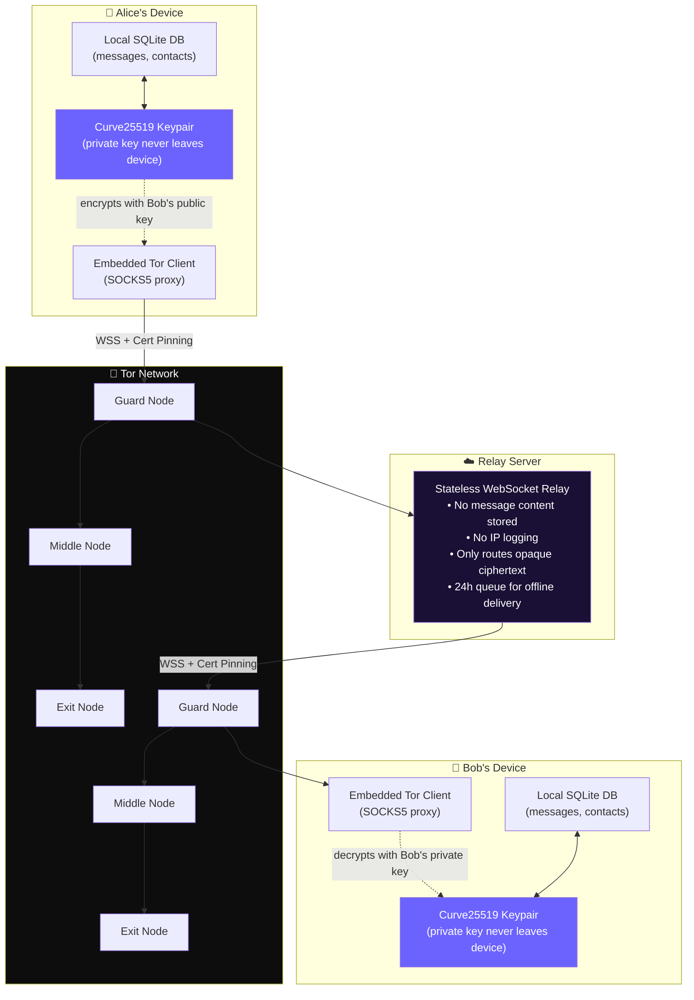
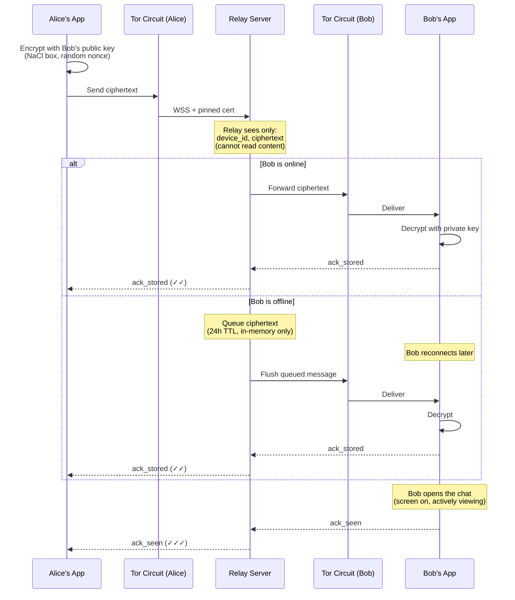

# D-Chat

A private messaging app built on one premise: **you shouldn't have to trust anyone to use it safely** — not the app's developer, not the server it connects to, not your internet provider, and not the network in between.

D-Chat has no accounts, no phone numbers, no usernames, and no central server that knows who you are. Messages are end-to-end encrypted before they ever leave your device, routed through Tor so your IP address is never exposed, and stored only on your phone — never in any cloud.

---

## Table of Contents

- [What D-Chat Is](#what-d-chat-is)
- [Architecture](#architecture)
- [Why You Don't Have to Trust Anyone](#why-you-dont-have-to-trust-anyone)
  - [You don't have to trust the relay server](#you-dont-have-to-trust-the-relay-server)
  - [You don't have to trust your ISP](#you-dont-have-to-trust-your-isp)
  - [You don't have to trust the network in between](#you-dont-have-to-trust-the-network-in-between)
  - [You don't have to trust D-Chat's developer](#you-dont-have-to-trust-d-chats-developer)
- [How Identity Works](#how-identity-works)
- [Message Lifecycle](#message-lifecycle)
- [Installing D-Chat](#installing-d-chat)
- [Updating to a New Version](#updating-to-a-new-version)
- [Known Vulnerabilities & Limitations](#known-vulnerabilities--limitations)
- [Building From Source](#building-from-source)

---

## What D-Chat Is

| Feature | How it works |
|---|---|
| No accounts | A Curve25519 keypair is generated on your device the moment the app is installed. That keypair *is* your identity. |
| No usernames | Contacts are identified by a hash of their public key. You assign a private nickname to each contact yourself — no one else ever sees it. |
| End-to-end encryption | Every message is encrypted with NaCl `box` (Curve25519 + XSalsa20 + Poly1305) using the recipient's public key. Only their private key can decrypt it. |
| No cloud storage | Messages live only in an on-device SQLite database. Uninstalling the app permanently deletes everything. |
| IP protection | All network traffic is routed through an embedded Tor client — your real IP address is never visible to the relay server or anyone watching your network. |
| Minimal relay | The server that shuttles encrypted messages between devices never sees plaintext, never sees usernames, and doesn't log IP addresses or connection metadata. |

---

## Architecture



### Layers, from the inside out

1. **Application layer (E2EE)** — messages are encrypted on the sender's device and can only be decrypted by the intended recipient. This layer doesn't care who's transporting the data.
2. **Transport layer (Tor)** — the encrypted blob is sent through the Tor network, so the relay server (and anyone between you and it) only ever sees a Tor exit node's IP, never yours.
3. **Wire layer (TLS + certificate pinning)** — the connection to the relay is TLS-encrypted, and the app pins the relay's certificate so a forged or state-issued certificate authority can't intercept traffic even if installed on the device.
4. **Storage layer (on-device only)** — decrypted messages exist only in your local, sandboxed app storage. Nothing is ever backed up to a cloud service.

---

## Why You Don't Have to Trust Anyone

### You don't have to trust the relay server

The relay's only job is to forward encrypted bytes between two devices. It is architecturally incapable of doing anything else with your data:

| What the relay receives | What the relay can do with it |
|---|---|
| `device_id` (a hash of a public key) | Route traffic. Cannot reverse it to find your identity. |
| Ciphertext blob | Nothing — it doesn't have the private key needed to decrypt it. |
| Delivery ACKs (`sent`/`stored`/`seen`) | Route them back to the sender. Contain no message content. |

The relay stores **nothing on disk**. Everything is in-memory only, with a 24-hour TTL for messages queued to an offline recipient. A server restart wipes all of it. There is no database, no user table, and — as of this codebase — no IP address logging at all.

### You don't have to trust your ISP

All traffic leaves your device already wrapped in a Tor circuit. Your ISP sees you connecting to the Tor network — a large, ordinary, and legal set of entry points — and cannot see what site or service you're actually reaching, or read anything about the content.

### You don't have to trust the network in between

Even setting Tor aside, the connection to the relay uses TLS with **certificate pinning**: the app hardcodes the relay's exact certificate fingerprint. If anyone — an ISP, a government, a compromised CA — tries to intercept the connection with a different certificate (even one that Android's system trust store would normally accept), the app refuses to connect at all.

### You don't have to trust D-Chat's developer

This is the honest limit of what "don't trust the app" can mean for any piece of closed-loop software: if you install a prebuilt APK from someone else, you are trusting that the binary matches the source code you can read. D-Chat's answer to this is:

- **The full source is public** — every line, including the relay server, is on GitHub.
- **You can build it yourself** — see [Building From Source](#building-from-source). A self-built APK from the same commit as a release should produce a bit-for-bit identical binary (this project does not yet publish formal reproducible-build verification — see [Vulnerabilities](#known-vulnerabilities--limitations)).
- **You can self-host the relay** — nothing about the protocol requires using any specific server. Point your build at your own relay and you no longer need to trust anyone else's infrastructure at all.

---

## How Identity Works

There is no server-side concept of "users." Identity is purely cryptographic:

```
On first launch:
  1. Generate a Curve25519 keypair on-device
  2. device_id = SHA256(public_key)
  3. Private key → Android Keystore (hardware-backed secure storage)
  4. Public key + device_id → shown as a QR code

When you scan someone's QR code:
  1. You now have their public_key and device_id
  2. You choose a LOCAL nickname for them — stored only on your device
  3. Your app can now encrypt messages that only they can decrypt
```

No name, phone number, or email is ever generated, requested, or transmitted — by design, there is nothing of that kind to leak.

---

## Message Lifecycle



---

## Installing D-Chat

D-Chat is not on the Google Play Store — intentionally, since Play Store distribution requires Google Play Services integration that this project avoids for privacy reasons.

1. Go to the [Releases page](../../releases) of this repository
2. Download the latest `.apk` file
3. On your Android phone, open the downloaded file
4. If prompted, allow installation from this source (Settings → Security → **Install unknown apps**, for your browser or file manager)
5. Install and open

---

## Updating to a New Version

Since D-Chat isn't distributed through an app store, there's no automatic update mechanism — and that's a deliberate choice, since automatic update-checking would mean the app silently phoning home to check a version number, which conflicts with the zero-telemetry design.

**To update:**
1. Download the new `.apk` from the [Releases page](../../releases)
2. Install it directly over the existing app — Android handles this as an in-place upgrade

**⚠️ Important — your data is only preserved if the new APK is signed with the same key as your current install.** Every official release from this repository is signed with the same release key, so official updates always work seamlessly and preserve your contacts and message history.

If you ever see an `INSTALL_FAILED_UPDATE_INCOMPATIBLE` error, it means the APK you're installing was signed with a *different* key than what's currently on your phone (for example, mixing an official release with a self-built development APK). In that case, you must uninstall the old version first — which, per this app's privacy design, **permanently erases all local data** before the new version can be installed.

---

## Known Vulnerabilities & Limitations

Security software should be honest about what it doesn't protect against. These are real, current limitations of this implementation — not hypothetical edge cases.

### 1. The relay can see *when* and *how often* devices communicate
Even though message content is fully opaque, the relay observes connection timing, message frequency, and roughly how much data is exchanged between two `device_id` values. This is a **communication graph**, not a content leak, but it is metadata that could theoretically be used to infer that two people are in regular contact — a limitation shared with essentially all centralized-relay messengers, including Signal.

### 2. SNI / domain leakage to the Tor exit node
The relay is currently reached at a normal clearnet domain (not a Tor `.onion` hidden service). This means the **Tor exit node**, and anyone positioned between that exit node and the relay, can see via the TLS handshake (SNI) that a Tor circuit is connecting to *this specific relay domain* — revealing "this Tor user is using D-Chat," even though they cannot see message content or your real IP. A `.onion` hidden service for the relay would close this gap entirely, but is not yet implemented in this codebase.

### 3. No forward secrecy
Encryption uses a single, static Curve25519 keypair per device (NaCl `box`), not a ratcheting protocol like Signal's Double Ratchet. This means **if your private key is ever extracted** — through device theft, malware, or forensic extraction — an attacker who has also been recording your encrypted traffic could retroactively decrypt every message you've ever sent or received with that key. Signal-style forward secrecy (where each message uses a fresh, disposable key) is a meaningful upgrade this project does not yet have.

### 4. Traffic correlation is theoretically possible for a global adversary
Tor protects against any single party learning both who you are and what you're doing. It does **not** fully protect against an adversary capable of monitoring traffic at *both* your entry point and the relay's exit point simultaneously (a "global passive adversary"). This is a known, general limitation of Tor itself, not specific to D-Chat, but worth stating plainly: Tor provides strong practical anonymity, not mathematically absolute anonymity against a nation-state-level observer with that level of network visibility.

### 5. Physical device compromise defeats everything
If someone has your unlocked phone, or extracts data via a rooted device / forensic tooling that can bypass the Android Keystore, all local protections (encrypted storage, hardware-backed key storage) can potentially be bypassed. D-Chat protects data **in transit** and **at rest against remote attackers and casual access**; it is not designed to resist a well-resourced adversary with sustained physical access to an unlocked or compromised device.

### 6. Screenshots and screen capture are not blocked
The app does not currently set `FLAG_SECURE` (the Android flag that blocks screenshots and screen recording). Any app with screen-capture permission, or a malicious accessibility-service app, could capture message content directly off the screen while you're reading it.

### 7. Contact verification is trust-on-first-scan
Adding a contact is based entirely on scanning their QR code in person. There is no secondary verification step (like Signal's "safety number" comparison) to confirm that the public key you scanned genuinely belongs to the person you think it does, if the QR exchange itself were somehow tampered with (e.g., a malicious screen overlay swapping the displayed code). In practice, an in-person QR scan is quite strong, but there's no built-in mechanism to *re-verify* a key later if you suspect it may have changed.

### 8. A malicious relay can deny service, even though it can't read content
Because the relay is a single chokepoint for delivery, a compromised or hostile relay operator could selectively drop, delay, or refuse to deliver specific messages — an availability attack, not a confidentiality one. It cannot read or forge messages (NaCl's authentication would cause forged messages to fail decryption), but it can choose not to deliver them.

### 9. Reproducible builds are not yet independently verifiable
While the source code is fully public, this project does not yet publish a formal reproducible-build process or checksums that let a third party verify that a released `.apk` was built *exactly* from the corresponding public source, with nothing added or changed. Until that's in place, installing a prebuilt release still requires some trust in the release process itself — building from source yourself removes this trust requirement entirely.

### 10. No rate limiting or anti-abuse controls on the relay
The relay currently has no protection against a flood of connections or messages from a single source, which could be used to degrade service (a denial-of-service risk against relay availability, not against message confidentiality).

---

## Building From Source

Full setup instructions are in [`BUILD.md`](./BUILD.md), covering:
- Local Android build environment setup (JDK, Android SDK, `adb`)
- Building a debug or release APK with `npx expo run:android` or EAS Build
- Generating and safely storing your own release signing key
- Certificate pinning setup — see [`CERT_PINNING.md`](./CERT_PINNING.md)

Building your own copy from source, and optionally pointing it at your own self-hosted relay (`d-chat-relay-server`), removes every remaining trust dependency described in this document.

---

## License

*(Add your chosen license here.)*
